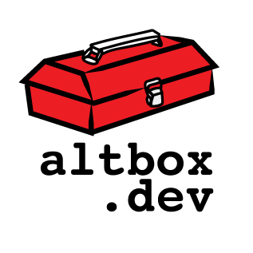

# altbox



Website for [altbox.dev](https://altbox.dev), the alternative toolbox for developers.

## About

altbox is a static site that showcases alternative CLI tools for Linux/macOS/Unix — modern
replacements for standard tools like `grep`, `ls`, and others. Built with [Astro](https://astro.build).

## Todo

- Add arbitrary tagging for things like "JSON" or "YAML" or "Markdown".

## Prerequisites

- Node.js (v18 or later)
- npm

## Setup

``` bash
npm install
```

## Development

``` bash
npm run dev
```

Starts a local dev server at `http://localhost:4321` with hot reload.

## Building

``` bash
make
```

This runs `rsync` to copy tool assets from `content/tools/` into `public/tool/`, then
runs `npm run build`. Output goes to `dist/`. Deploy by rsyncing that directory to the server:

``` bash
make rsync
```

## Directory structure

``` text
tools/
  TOOLNAME/          One directory per tool
    index.yaml       Tool metadata and body text
    screenshot.png   Tool assets (images, GIFs, SVGs) live alongside the YAML
public/
  tool/TOOLNAME/     Per-tool assets copied here at build time (not in Git)
  assets/img/        Site-wide images (logo etc.)
src/
  layouts/           Base HTML layout (Layout.astro)
  lib/               Shared utilities (load tools, render Markdown)
  pages/             Astro pages — one file per URL pattern
    index.astro                  Home page (lists all tools)
    tool/[name].astro            Individual tool page
    alternative-to/[tool].astro  All tools alternative to a given standard tool
    language/[lang].astro        All tools written in a given language
  plugins/           Custom remark plugin for screenshot shortcodes
  styles/            Global CSS
dist/                Built output (not in Git — generated by make)
```

## Adding a tool

Create a new directory `tools/TOOLNAME/` with an `index.yaml` file. The directory
name doesn't matter; the `name` field is used for the URL slug. Example:

``` yaml
---
name: fd
author: David Peter
homepage: https://github.com/sharkdp/fd
project: https://github.com/sharkdp/fd
language: Rust
alternativeto: find
description: A simple, fast, and user-friendly alternative to find.
last_updated: 2026-03-15
screenshots:
    - file: screenshot.png
      caption: fd finding files by name
body: |
    `fd` is a simple, fast alternative to `find`...

    {{screenshot: screenshot.png, fd finding files by name}}
```

To list multiple alternatives, use a YAML list:

``` yaml
alternativeto:
    - du
    - df
```

The tool will automatically appear on:

- `/tool/fd`
- `/alternative-to/find`
- `/language/rust`
- The home page
- The sidebar (for each `alternativeto` value that is new)

## Code style

- Use 4-space indentation in all files (JS, CSS, Astro, YAML)

## YAML conventions

- Start every file with `---`
- Do not include a `tags` field — it is unused
- `alternativeto` is a plain string for one value, a YAML list for multiple
- `alternativeto` values should be lowercase
- `last_updated` format is `YYYY-MM-DD`
- Leave `homepage:` blank (not omitted) if the tool has no separate homepage
- If `homepage` and `project` are the same URL, only `project` is needed — the tool page deduplicates them

## Screenshots

Put screenshot images in `tools/TOOLNAME/` alongside `index.yaml`.
Reference them in the `body` field using just the filename:

``` markdown
{{screenshot: screenshot.png, Caption text here}}
```

This is transformed into a `<figure>` element at build time by the remark plugin in
`src/plugins/remark-screenshots.js`. Asset paths are resolved to `/tool/TOOLNAME/filename`
automatically by `src/lib/tools.js` when the YAML is loaded.

## URL slugs

`language` value is lowercased for URLs. For example, `language: Rust` produces the URL `/language/rust`.

`alternativeto` values are used as-is (they should already be lowercase, e.g. `grep`, `ls`).
A tool can have multiple `alternativeto` values — use a YAML list in that case.
