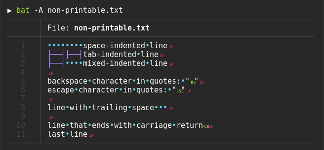

### Automatic paging

`bat` can pipe its own output to `less` if the output is too large for one screen.

### Syntax highlighting

`bat` supports syntax highlighting for a large number of programming and markup
languages:

### Git integration

`bat` communicates with `git` to show modifications with respect to the index
(see left side bar):

### Show non-printable characters

You can use the `-A`/`--show-all` option to show and highlight non-printable
characters:

