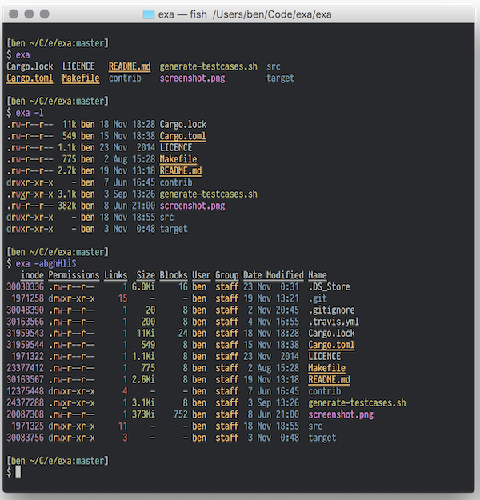
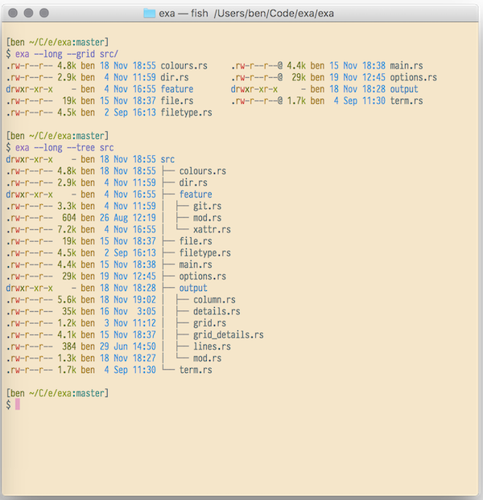

---
title: "exa"
tool: exa
description: "A modern replacement for ls"
author: "Benjamin Sago"
website: https://the.exa.website/
project: https://github.com/ogham/exa
language: Rust
alternativeto: ls
layout: tool
card_image: /exa/screenshot-black.png
tweets:

`exa` is a modern replacement for the command-line program `ls` that ships
with Unix and Linux operating systems, with more features and better
defaults.  It uses colours to distinguish file types and metadata. It knows
about symlinks, extended attributes, and Git. And it’s small, fast, and
just one single binary.

By deliberately making some decisions differently, `exa` attempts to be a
more featureful, more user-friendly version of `ls`.

